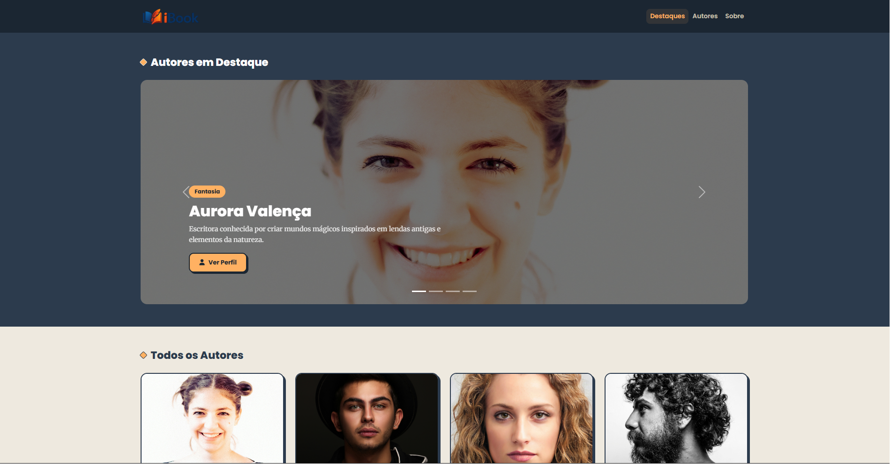
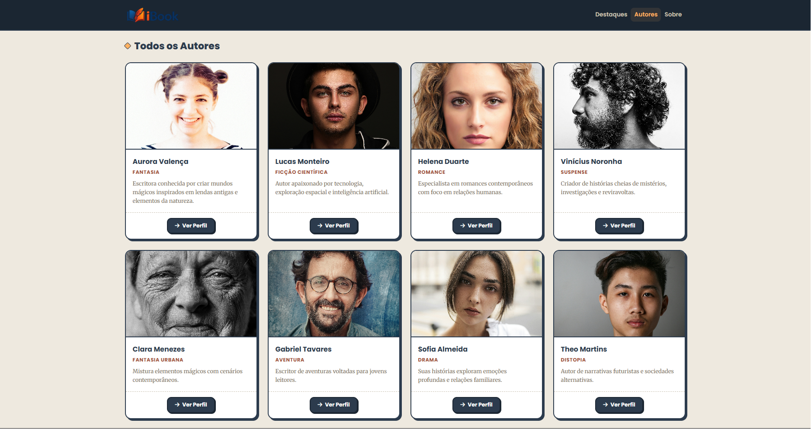
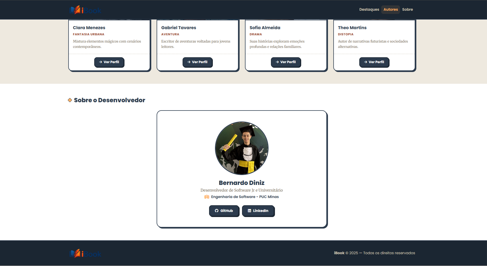
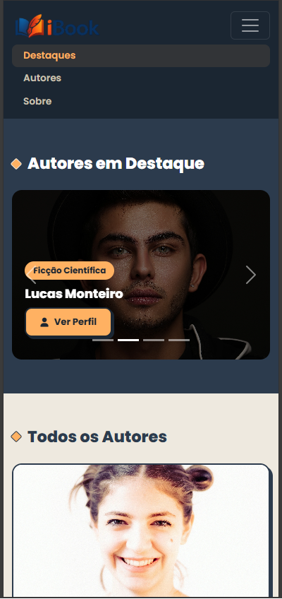
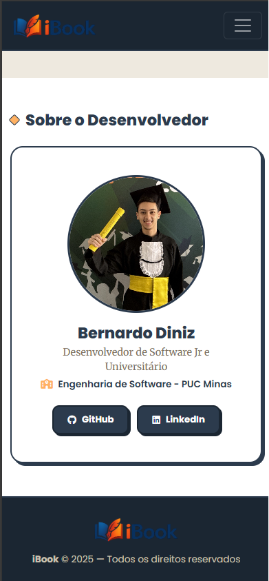
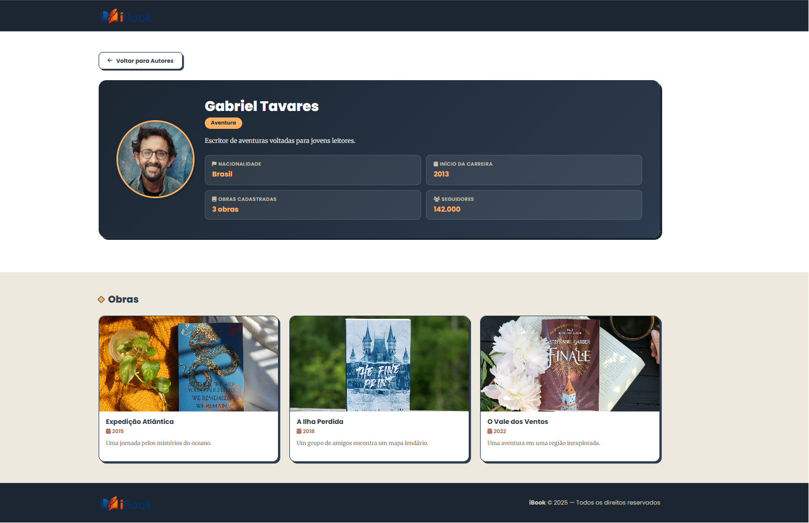
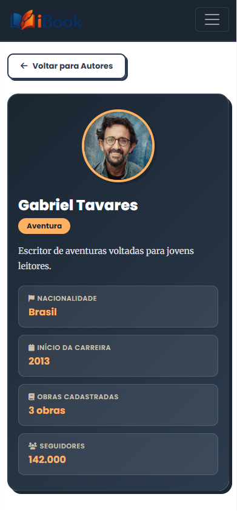
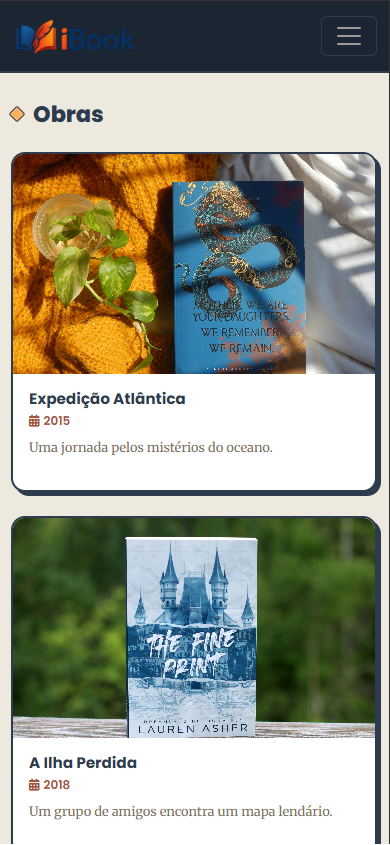

[](https://classroom.github.com/a/_2wsftuC)

# Trabalho Prático - Semana 13

Nessa etapa, você irá evoluir o projeto do semestre, montando o ambiente de desenvolvimento mais completo, típico de projetos profissionais. Nesse processo, vamos utilizar um **servidor backend simulado** com o JSON Server que fornece uma APIs RESTful a partir de um arquivo JSON.

Para esse projeto, além de mudarmos o JSON para o JSON Server, vamos permitir o cadastro e alteração de dados da entidade principal (CRUD).

## Informações do trabalho

- **Nome:** Bernardo Diniz
- **Matrícula:** 908681
- **Projeto:** iBook — Plataforma de Descoberta de Autores e Obras Literárias
- **Descrição:** Plataforma web para explorar autores de literatura e suas obras. A Home exibe um carrossel de destaques e uma grade de cards. A página de detalhe mostra o perfil completo do autor e suas obras.

---

## Estrutura do db.json

O arquivo `db/db.json` contém três coleções:

### Coleção principal: `autores`

Cada autor possui os seguintes campos:

```json
{
  "id": "1",
  "nome": "Aurora Valença",
  "genero": "Fantasia",
  "biografia": "Escritora conhecida por criar mundos mágicos...",
  "inicioCarreira": 2016,
  "nacionalidade": "Brasil",
  "seguidores": 187500,
  "destaque": true,
  "imagem_principal": "assets/images/autores/...",
  "obras": [
    {
      "id": 1,
      "titulo": "As Crônicas de Eldoria",
      "ano": 2018,
      "descricao": "Uma jornada épica através de reinos esquecidos.",
      "imagem": "assets/images/livros/..."
    }
  ]
}
```

- **Total:** 10 autores
- **Categorias:** Fantasia, Ficção Científica, Romance, Suspense, Fantasia Urbana, Aventura, Drama, Distopia, Terror, Crônicas
- **Obras:** 3 obras por autor (30 no total)
- **Campo `destaque`:** 4 autores marcados como `true`, exibidos no carrossel

### Coleção adicional: `categorias`

Lista dos 10 gêneros literários presentes no projeto.

### Coleção adicional: `usuarios`

Reservada para futuras evoluções do projeto (autenticação).

---

## Rotas da API utilizadas

| Método | Endpoint | Função |
|--------|----------|--------|
| GET | `/autores` | Lista todos os autores (Home) |
| GET | `/autores?destaque=true` | Lista autores em destaque (Carrossel) |
| GET | `/autores/:id` | Busca autor por ID (Detalhe) |
| POST | `/autores` | Cadastra novo autor (Formulário) |

---

## Prints do trabalho

### Home — Cards dos autores carregados via API

**Desktop**
**Desktop**




**Mobile**





### Detalhes — Perfil do autor com obras

**Desktop**


**Mobile**


